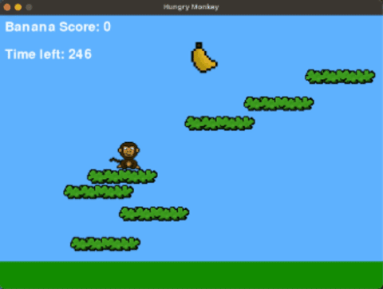
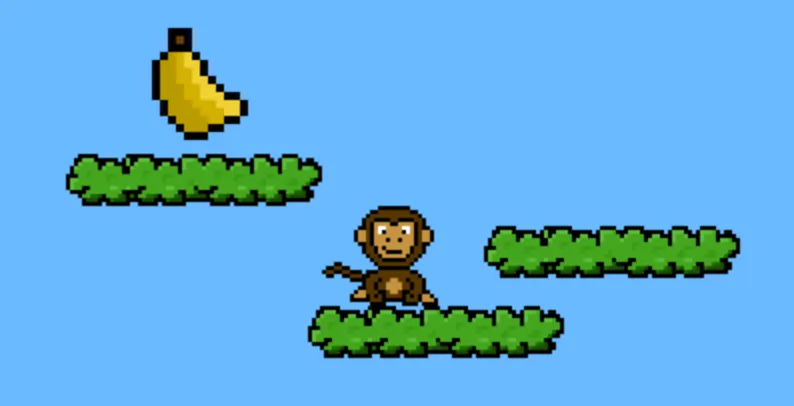
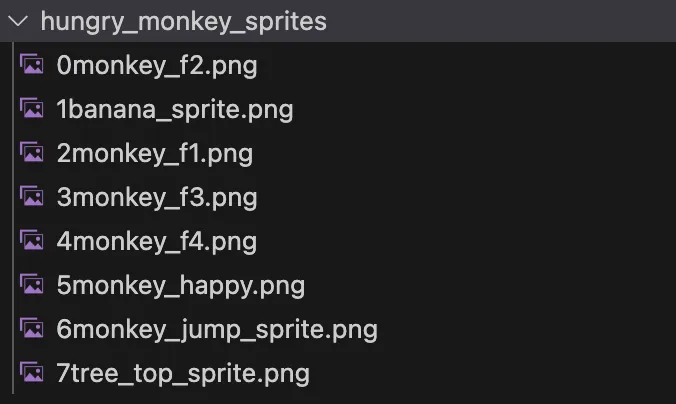
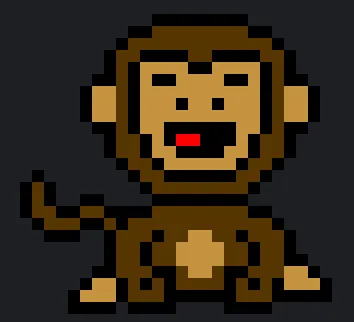

# Hungry Monkey Workshop

## Anyone can make a video game

And that includes **YOU!** 

Game-making may seem like a daunting task, but I *super-duper-pinky-promise* that you have what it takes. Games are a wonderful opportunity for creativity to run wild, to express yourself, and to connect with others, and today we’re gonna learn to make a simple platformer game about a hungry monkey together.



## Getting Started

If you’ve already got Python and PyGame installed on your computer, you can skip this section.

First, we’re gonna need to make sure Python is installed on your computer. To download it, follow this link: [https://www.python.org/downloads/](https://www.notion.so/Hungry-Monkey-Workshop-140b757f08a880e5a845cf8c0641fe2d?pvs=21). After it’s downloaded, click on it and follow the instructions to get it fully installed.

Make sure to download the version of PyGame that is compatible with your OS (Windows, macOS, etc)! Then, in either your **PowerShell/Command Prompt** (for Windows) or **Terminal** (for macOS), type the following command to install PyGame (the library we’ll be using to make our game):

# For Windows
`py -m pip install pygame --user`

# For macOS:
`python3 -m pip install pygame --user`
​
## Game Foundations
Every game needs three basic components:
A window (to display the game on)
A game loop (to run and update the game frame by frame)
Event handling (to check for things like key strokes, mouse clicks, etc). 
To implement these basic features, create a file in VS Code and name it hungry_monkey.py , or any name that ends in .py. Now simply copy and paste the following code into your VS Code. As we go through this workshop, if you’re every curious about how a handful of specific lines work, there are comment explaining what most little chunks are doing. However, you don’t need to read every comment or line of code by any means.

```python
# Importing libraries that we'll be using
import pygame
import sys
import random

# Initializing pygame
pygame.init()

# These set us up to be able to use text and timers later
font = pygame.font.SysFont(None, 36)
clock = pygame.time.Clock()

# Defining the window we will display our game on (in terms of pixels)
SCREEN_WIDTH = 700
SCREEN_HEIGHT = 500
screen = pygame.display.set_mode((SCREEN_WIDTH, SCREEN_HEIGHT))
pygame.display.set_caption('Hungry Monkey')


def game_loop():
	"""This function runs our main game loop, yippie!"""
	
	running = True
	while running == True:
	
		# Here is an instance of event handling, checking if the user wants to exit
		for event in pygame.event.get():
			if event.type == pygame.QUIT:
				running = False
				pygame.quit()
				sys.exit()
				
		# Rest of game loop goes here
		
game_loop()
```

Now let’s try running our code. If you are using VS Code, there should be a play button that’ll let you run the file. Otherwise, type `python -m <your_file_name>` into your terminal.

You should see a black box appear on your screen that’ll stay there until you hit the exit button. Hurray!

If you don’t see this, try entering the following code into your VS Code terminal:

```python
#For Windows:
pip install pygame

#For MacOS
pip3 install pygame
```

Alright, let’s take a  step back to look at what we’ve made so far. Two minutes ago, we had an empty file, and now we have all the basic components we need to make a game! If you’re making your own game from scratch, this is a good place to start from. Right now though, we’re gonna keep building on these foundations to make our Hungry Monkey game together.

## Graphics ✨
Let’s import some snazzy graphics for our monkey game. Create a new folder in VS Code called `hungry_monkey_sprites`. Now download the following `.png` files that’ll serve as the pixel art for our game:  Pixel Art (Download each png, then move into hungry_monkey_sprites folder)


(If you want to make your own pixel art, [piskelapp.com](http://piskelapp.com) is a great resource.)

Once you’ve downloaded all eight `.png`  files, drag and drop them individually into your newly made `hungry_monkey_sprites` folder so we can access them later. Your file should look something like this (make sure each file’s name matches this example to avoid issues when importing these graphics alter):


## Variables
Now, back to our `hungry_monkey.py` file. Let’s define a whole bunch of global variables just above where we defined the `game_loop()` function. These’ll make our code a lot more readable and adjustable down the road.

```python
#GLOBAL VARIABLES
platform_width = 128
platform_height = 10
platform_list = []
#Here's where we import the pixel art for our leafy platforms.
#You can also import any image from your computer by instead typing in
#your computer's path to that file, e.g. (f"/path/to/file_name.png)
platform_img = pygame.image.load(f"hungry_monkey_sprites/7tree_top_sprite.png")
num_platforms = 8

#We can use pygame.Rect to make a invisible rectangular object 
#to detect things like collisions
#It follows the format: pygame.Rect(<topleft_x>,<topleft_y>,<width>,<height>)
floor = pygame.Rect(0, SCREEN_HEIGHT - 50, SCREEN_WIDTH, 50)


monkey_x = int(SCREEN_WIDTH / 2)
monkey_y = SCREEN_HEIGHT - 100
gravity = 1
velocity_y = 0
monkey_size = 50
jump_power = -17
monkey = pygame.Rect(monkey_x, monkey_y, monkey_size, monkey_size)
is_jumping = False
monkey_img = pygame.image.load(f"hungry_monkey_sprites/2monkey_f1.png")

frame = 0
frames_left = 1000 #How many frames are left before game over

score = 0
top_score = 0
#The banana will be our player's goal
banana_x, banana_y = int(SCREEN_WIDTH / 2), 50
banana = pygame.Rect(banana_x,banana_y, 50, 50)

#Some RGB values we might want to use
DARK_GREEN = (0, 150, 0)
SKY_BLUE = (105, 186, 255)
WHITE = (255,255,255)
```

Important note about graphics here: PyGame’s coordinate system has the origin (0,0) in the top left corner of the screen, with x increasing to the right and y increasing downwards. This is important for defining rectangles and drawing graphics.

## Functions
Now we’re going to define some functions that accomplish certain tasks. Functions help us to organize our code and make it a lot easier to play around with. Take note of how, even though some of the functions are a bit big and may look complicated, by grouping many lines of code together we are able to understand them as a single set of instructions that complete’s a bigger task that we do understand. 

## Draw Setting
Under the global variables we just defined, add the `draw_setting()` function, which will help us to draw the background, platforms, and banana. 

```python
def draw_setting():
	"""Draws background, platforms, floor, and banana onto our screen"""
	# For each new frame, we want to redraw our background over the previous frame
	pygame.draw.rect(screen, SKY_BLUE, (0, 0, SCREEN_WIDTH, SCREEN_HEIGHT))

	for platform in platform_list:
		# screen.blit is how you draw one surface (like images) onto another (like our window)
		screen.blit(platform_img, platform)

	# Drawing the floor
	pygame.draw.rect(screen, DARK_GREEN, floor)

	# Drawing banana
	if len(platform_list) == num_platforms:
		banana_img = pygame.image.load(f"hungry_monkey_sprites/1banana_sprite.png")
		screen.blit(banana_img, (banana_x,banana_y))

	# Drawing score
	score_txt = font.render(f"Banana Score: {score}", True, (255,255,255))
	screen.blit(score_txt, (10, 10))
```

If you ever run into errors with importing the images/sprites correctly, double check that `pygame.image.load(f"hungry_monkey_sprites/<file>.png")` has the correct pathway to your desire image. You may have mistyped the file name, or if your `hungry_monkey_sprites` folder is in another file, you’ll need to add that folder to the path way as follows: `“<bigger_folder>/hungry_monkey_sprites/<file>.png”`

## Update Character
The `update_monkey()` function will update our character’s coordinates, animate it, and check if it’s on a platform/floor or touching the banana. Note how we use event handling so that the monkey jumps whenever whenever space is pressed and moves left/right whenever A/D is pressed, respectively. This function’s on the chunkier side, so don’t worry about reading every bit of it right now. It’s okay to just understand how it functions as a unit.

```python
def update_monkey():
	"""Control monkey's movement and image, and detect collisions with platforms and banana"""
	#Globals allow us to edit variable that exist outside of this function
	global monkey_x, monkey_y, velocity_y, monkey, monkey_img, platform_list,score

	#Constantly applying gravity to monkey
	velocity_y += gravity
	monkey_y += velocity_y

	#Here's how you detect keystrokes:
	key_pressed = pygame.key.get_pressed()
	if key_pressed[pygame.K_a]:
		monkey_x -= 5
	elif key_pressed[pygame.K_d]:
		monkey_x += 5
	#Update monkey's x and y coordinates
	monkey = pygame.Rect(monkey_x, monkey_y, monkey_size, monkey_size)

	#Check if monkey is on a platform
	for platform in platform_list:
		if monkey.colliderect(platform) and velocity_y > 0:
			monkey_y = platform[1] - monkey_size #platform[1] stores the platform's y coordinate
			velocity_y = 0
			if key_pressed[pygame.K_SPACE]: #Monkey can only jump when standing on something
				velocity_y = jump_power
	if monkey.colliderect(floor):
		monkey_y = floor[1] - monkey_size
		velocity_y = 0
		if key_pressed[pygame.K_SPACE]:
			velocity_y = jump_power
		#Generate new platforms every time the ground is touched (won't generate if there are enough platforms)
		generate_platforms()

	#Animate the monkey
	sprite_frame = int((frame / 5) % 4) + 1
	if len(platform_list) == num_platforms:  # Whenever platforms are all generated, play the animation
		if sprite_frame == 1:
			current_sprite = f"hungry_monkey_sprites/2monkey_f1.png"
		elif sprite_frame == 2:
			current_sprite = f"hungry_monkey_sprites/0monkey_f2.png"
		elif sprite_frame == 3:
			current_sprite = f"hungry_monkey_sprites/3monkey_f3.png"
		else:
			current_sprite = f"hungry_monkey_sprites/4monkey_f4.png"
		monkey_img = pygame.image.load(current_sprite)
	if velocity_y < 0 and len(platform_list) == num_platforms: #Jumping sprite
		monkey_img = pygame.image.load(f"hungry_monkey_sprites/6monkey_jump_sprite.png")
	# Detect banana collision
	if monkey.colliderect(banana) and len(platform_list) == num_platforms:
		platform_list = []
		monkey_img = pygame.image.load(f"hungry_monkey_sprites/5monkey_happy.png")
		score += 1

	#Draw monkey onto screen
	screen.blit(monkey_img, (monkey_x, monkey_y))
```

## Game Over Screen
Now we’ve gotta create a game over screen for when the timer runs out. We’ll wanna use text to display the current score, top score, and give the user the choice to restart or exit. Our `game_over_display()` function will help us do this.

```python
def game_over_display():
	"""Displays game stats whenever time runs out"""
	global score

	screen.fill(SKY_BLUE)
	game_over_txt = font.render("Game Over", True, WHITE)
	score_txt = font.render(f"Your score was: {score}", True, WHITE)
	top_score_txt = font.render(f"The high score is: {top_score}",True,WHITE)
	restart_txt = font.render("Press R to restart, or Q to quit",True, WHITE)

	#Draw the above text onto the screen
	screen.blit(game_over_txt, (SCREEN_WIDTH // 2 - game_over_txt.get_width() // 2, SCREEN_HEIGHT // 2 - 100))
	screen.blit(score_txt, (SCREEN_WIDTH // 2 - score_txt.get_width() // 2, SCREEN_HEIGHT // 2 - 50))
	screen.blit(top_score_txt, (SCREEN_WIDTH // 2 - top_score_txt.get_width() // 2, SCREEN_HEIGHT // 2))
	screen.blit(restart_txt, (SCREEN_WIDTH // 2 - restart_txt.get_width() // 2, SCREEN_HEIGHT // 2 + 50))
	pygame.display.update()

	# Wait for restart or quit input
	input_waiting = True
	while input_waiting:
		for event in pygame.event.get():
			if event.type == pygame.QUIT:
				pygame.quit()
				sys.exit()
			if event.type == pygame.KEYDOWN:
				if event.key == pygame.K_r: # Press R to restart
					input_waiting = False
					game_loop() # Restart the game
				elif event.key == pygame.K_q: # Press Q to quit
					pygame.quit()
					sys.exit()
```

## Just a Few More Functions…
Alright, hold on tight, we’ve only got a few more functions to implement before we have our complete game! Let’s define three smaller variables:
- `advance_timer()` will update our game timer that counts down the time left for each run through (notice how it calls the `game_over_display()` function when time runs out).
- `generate_platforms()` does what it says on the tin.
- `reset_variables()` resets certain variables to their starting values, which we’ll use to refresh the game each time `game_loop()` is called.

```python
def advance_timer():
	"""Every frame, reduce the time left for the game and display this change"""
	global top_score, frames_left

	frames_left -= 1
	timer_txt = font.render(f"Time left: {frames_left}", True, (255, 255, 255))
	screen.blit(timer_txt, (10, 60))

	#Check if the timer has run out, meaning the game is over
	if frames_left <= 0:
		if score > top_score:
			top_score = score
		game_over_display()

def generate_platforms():
	"""Whenever there are fewer platforms than desired num_platforms, generate new random ones"""
	current_platform_count = len(platform_list)
	while current_platform_count < num_platforms:
		platform_x = (random.randint(0, SCREEN_WIDTH - platform_width)) #random.randint(a,b) generate a random integer between a and b
		platform_y = (random.randint(80 + (current_platform_count * (SCREEN_HEIGHT - 80) // num_platforms),(80 + (current_platform_count + 1) * (SCREEN_HEIGHT - 80) // num_platforms)))
		#Create new rectangles for these platforms, and store them in platform_list
		platform_list.append(pygame.Rect(platform_x, platform_y, platform_width, platform_height))

		current_platform_count += 1

def reset_variables():
	"""Every time the game_loop is rerun, reset relevant variables"""
	global frames_left, score, platform_list, monkey_x, monkey_y

	frames_left = 1000
	score = 0
	platform_list = []
	generate_platforms()
	monkey_x = int(SCREEN_WIDTH / 2)
	monkey_y = SCREEN_HEIGHT - 100
```

## Almost Done!!
The last step is to call these functions in our `game_loop()`. Update your `game_loop()` function to look like this:
```python
def game_loop():
	"""This function runs our main game loop, yippie!"""
	global frame
  
	reset_variables()
	running = True
	while running:
		#Here is an instance of event handling, checking if the user wants to exit
		for event in pygame.event.get():
			if event.type == pygame.QUIT:
				running = False
				pygame.quit()
				sys.exit()

		draw_setting() #Drawing floor, platforms, and banana
		update_monkey() #Let's allow our monkey to move and collide with things
		advance_timer() #Progress the game timer and check if it's run out

		# Now that we've made our changes to the frame, let's update the screen to reflect those changes:
		pygame.display.update()
		clock.tick(30) #This functions helps us cap the FPS (Frames per Second)
		frame += 1 #We use this frame variable to animate our monkey
```

## You’ve Just Made a Game! 🎉
Boom! We just made our Hungry Monkey game! Try running the file now. If everything’s typed in correctly, a window should pop up where you can play the game. Remember, use space to jump and the A and D keys to move left and right.



## Now to Add Your Own Pizzazz
Alright, now that we’ve finished making the hungry game, it’s time for the fun part. :D

Mess with the code! Play around with it. See what weird, interesting, and fun things you can make it do by changing variables and moving things around. Add your own lines of code. Just break the game and make it into something that’s new and exciting to you.

Depending on where your curiosities lie, here’s some helpful resources for exploring new ideas:

- [piskelapp.com](http://piskelapp.com) - Make pixel art, download it, and drop it into your sprites folder
- Download any image you want to use!
- [PyGame Zero](https://pygame-zero.readthedocs.io/en/stable/introduction.html) - Very beginner-friendly resource for learning more about PyGame features. Helpful tool if you’re confused about anything from this workshop or if you want to learn more about something new (e.g. sounds)
- [PyGame Docs](https://www.pygame.org/docs/) - PyGame has great instructions on how to make a game and use its different features (images, text, sounds, collisions, etc.)
- PyGame Cheat Sheet - Also at the bottom of this webpage is a list of common/helpful PyGame functions you might want to use (getting the mouse position, displaying text, etc.)

## Feedback

Thanks for building a game with us! We’d love to hear how your experience. If you fill out [this form](https://forms.hackclub.com/t/3MoMvJouQVus), you’ll be entered into a raffle for **a free Raspberry Pi**.

### PyGame Cheat Sheet

Here’s some often-used PyGame tools that you might want to use:

- Images and Surfaces:
    - `pygame.image.load(”path/to/image.type”)` - you’ll need to either import the image into your sprites folder or find what the pathway on your device is to the download
    - `pygame.transform.scale(surface, (width, height))`  - resize an image (or any surface)
    - `<surface>.screen.blit(other_surface, (x, y))` - draws one surface onto another
    - `pygame.display.update()` - updates entire screen
- Drawing and Shapes
    - `screen.fill.(color)` - fills screen with a color, which must be represented as an RGB color value like (255,255,255)
    - `pygame.Rect(x, y, width, height)` - creates a rectangular object, helpful for collisions and drawing rectangles
    - `pygame.draw.rect(surface, color, Rect)` - draws a rectangle onto the screen
- Collisions
    - `<first_rect>.colliderect(other_rect)` - detects if two rectangles are touching
    - `Rect.collidepoint((x, y))` - checks if a given point is inside a rectangle
- Events
    - `pygame.key.get_pressed()` - returns a list of bool (True or False) values that tell you whether a each key was pressed or not
    - `pygame.mouse.get_pos()` - returns the current coordinates of the mouse cursor
- Text
    - `pygame.font.SysFont(”font_name”, size)` - sets font style and size
    - `Font.render(”Text”, True, color)` - turns the text into a surface that you can display. Use with  `<surface>.screen.blit(other_surface, (x, y))` to display this text surface on your screen